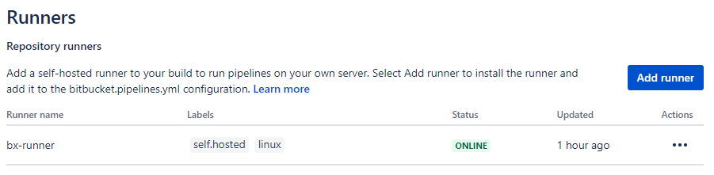
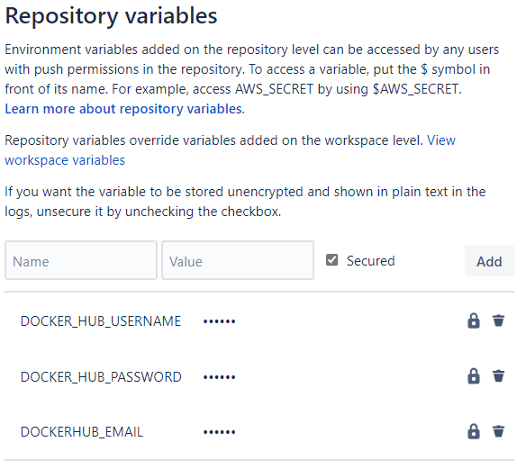

# Tutorial<br/>IAR Build Tools for Linux in a Bitbucket CI 

Each of the __IAR Build Tools for Linux__ packages requires its specific license. Please feel free to [__contact us__](https://iar.com/about/contact) if you would like to learn how to get access to them.

If you end up with a question specifically related to [this tutorial](https://github.com/iarsystems/bx-bitbucket-ci), you might be interested in verifying if it was already answered from [earlier questions][repo-old-issue-url]. Or, [ask a new question][repo-new-issue-url] if you could not find any answer for your question.


## Introduction
This tutorial provides a simple example with general guidelines on how to set up a CI (Continuous Integration) workflow with [IAR Build Tools for Linux][iar-bx-url] alongside [Bitbucket](https://bitbucket.org).

### Bitbucket
At Bitbucket, a private project repository, called [__origin__](https://git-scm.com/book/en/v2/Git-Basics-Working-with-Remotes) in the Git jargon, starts with a __master__ branch containing the __production__ code. 

The repository also contains a "recipe" for the workflow under `bitbucket-pipelines.yml`. The recipe is written in the [__YAML__](https://en.wikipedia.org/wiki/YAML) format and can be customized. We provided one simple example as base, although the [official documentation][bb-doc-yaml-url] can help with further customizations.

The repository will be configured to use one Bitbucket's self-hosted [runner][bb-doc-runner-url].

>:warning: Bitbucket requires an [account][bb-join-url].


### Build server
The __build server__ is a x64 Linux machine and it will be where the [__IAR Build Tools for Linux__][iar-bx-url] are installed.

It will serve as a self-hosted [runner][bb-doc-runner-url] from where the [pipeline][bb-doc-pipeline-url] will take place.  This runner will be configured to automatically connect to the __origin__. When triggered, the runner will execute a job that, after cloning the repository and will use the __IAR Build Tools for Linux__ to build these projects.


### Development workstation
On his workstation, a _developer_ clones the repository to start working on a new feature for some project. For that, he creates a __feature branch__.

The _developer_ then launches the [IAR Embedded Workbench][iar-ew-url], from where he can __code__, __build__ and __debug__ the project.

When the _developer_ is done with that, he can, through his own Bitbucket account, __push__ the branch to the __origin__ using a __git client__.

>:bulb: Bitbucket provides instructions on how [Install and set up Git](https://support.atlassian.com/bitbucket-cloud/docs/install-and-set-up-git/).

### The typical CI workflow
In a nutshell, the primary objective is to have automated builds within reproducible build environments. This workflow is useful for keeping track of any changes that potentially break the build before they are introduced into the __production__ branch. This practice can help raise the project's overall quality metrics.

When a _developer_ pushes changes to the __origin__, the Bitbucket Pipeline for the repository comes into play, triggering its associated runner in the __build server__.

On the build server, the runner will then execute the user-defined "recipe" to build the project with the __IAR Build Tools__. 

If the new feature passes, the _code reviewer_ can decide if these changes are ready to be merged to the __master__ branch.

If the new feature fails, the follow-up can be performed within Bitbuckets's own facilities for code revision.

This process repeats as many times as required.


## Conventions
As this tutorial is intended to be flexible with respect to the tools and packages that can be used, it becomes important to establish some conventions for when referring to certain entities.

### Packages
| __Placeholder__ | __Meaning__                                                                               |
| :-------------- | :---------------------------------------------------------------------------------------- |
| `<arch>`        | __Architecture__<br/>Valid: `arm`, `riscv`, `rh850`, `rl78`, `rx`                         |
| `<package>`     | __Product package__<br/>Valid: `arm`, `armfs`, `riscv`, `rh850`, `rh850fs`, `rl78`, `rx`  |
| `<version>`     | __Package version__<br/>Valid: `major`.`minor`.`patch` `[.build]`                         |

Here you will find some examples for different packages and their versions:
| __Package/Version__       | __Replace with__                                                                                                                               |
| :------------------------ | :--------------------------------------------------------------------------------------------------------------------------------------------- |
| BXARM 9.20.1              | IAR Build Tools for Arm version 9.20.1<br/>`<arch>`=`arm`<br/>`<package>`=`arm`<br/>`<version>`=`9.20.1`                                       |
| BXARMFS 9.20.3.45671      | IAR Build Tools for Arm, [Functional Safety Edition](https://www.iar.com/products/requirements/functional-safety/), version 9.20.3<br/>`<arch>`=`arm`<br/>`<package>`=`armfs`<br/>`<version>`=`9.20.3.45671` |
| BXRISCV 3.10.1            | IAR Build Tools for RISC-V version 3.10.1<br/>`<arch>`=`riscv`<br/>`<package>`=`riscv`<br/>`<version>`=`3.10.1`                                |

### Others
| __Placeholder__ | __Meaning__                                                                               |
| :-------------- | :---------------------------------------------------------------------------------------- |
| `<username>`    | Refer to the user's Bitbucket's account or the user's account in the local machine, according to the context.                    |

## Preparing the repository 
In order to illustrate the concept, we are going to import the [bx-workspaces-ci][bx-workspaces-url] repository. This is a public repository containing a collection of workspaces which were created using the IAR Embedded Workbench. They can be imported to become a private repository and then used for experimentation with the IAR Build Tools for Linux.

### Importing an example repository
Navigate to
```
https://bitbucket.org/repo/import
```

Fill __Old repository__ with
```
https://github.com/IARSystems/bx-workspaces-ci
```

Fill __Project name__ and __Repository name__. For this example, let's use `shr-private`:
```
shr-private
```

Make sure that __Access level__ is set to `Private repository`.

>:warning: Bitbucket adverts against using self-hosted runners with public repositories due [performance and security reasons][bb-private-url]. 

Finally, click __Import repository__.

Once the importing process is complete, a temporary message banner will show up:
>```
>"Import completed successfully."
>```
    
Then you will automatically be taken to the repository's page.

### Adding a workflow
On your `shr-private` repository, use the Bitbucket interface to add the following new file [`bitbucket-pipelines.yml`][bb-doc-pipeline-url]. This workflow contains 3 jobs to be run on the runner tagged as "self.hosted". This workflow first builds `library` and then, in the sequence, it builds `componentA` and `componentB`:
```yaml
definitions:
  buildProject: &buildProject
    name: Build the project
    runs-on:
      - self.hosted
    services:
      - docker
    script:
      - echo $DOCKER_HUB_PASSWORD | docker login -u $DOCKER_HUB_USERNAME --password-stdin
      - docker pull $DOCKER_HUB_USERNAME/bx<arch>:<version>
      - docker tag $DOCKER_HUB_USERNAME/bx<arch>:<version> bx<arch>:latest
      - docker run --detach --tty --name bx --hostname bxd-bb --volume $BITBUCKET_CLONE_DIR:/build bx<arch>
      - docker exec bx lightlicensemanager setup -s <lms2-server-ipv4>
      - docker exec bx iarbuild <arch>/library.ewp    -build Debug -log all 
      - docker exec bx iarbuild <arch>/componentA.ewp -build Debug -log all 
      - docker exec bx iarbuild <arch>/componentB.ewp -build Debug -log all 
    artifacts:
      - <arch>/Debug/Exe/*.a
      - <arch>/Debug/Exe/*.out
      - <arch>/Debug/List/*.map
pipelines:
  default:
    - step: *buildProject
```
>:warning: Change `<arch>`, `<version>` and `<lms2-server-ipv4>` to match with the __IAR Build Tools for Linux__ you are using. Please refer to [Conventions](#conventions) for details.

>:bulb: Find more information on how to [configure your pipeline](https://support.atlassian.com/bitbucket-cloud/docs/configure-your-pipeline/).

### Adding a runner to the repository
The Bitbucket repository must be set to use __Pipelines__.

>:warning: Bitbucket requires [__Two-step verification__][bb-2-factor-url] before allowing to enable __Pipelines__.

Go to __Repository settings__ → __Pipelines__ → __Settings__.
```
https://bitbucket.org/<username>/shr-private/admin/addon/admin/pipelines/settings
```

And __Enable Pipelines__.

Go to __Repository settings__ → __Pipelines__ → __Runners__ → __Add runner__.

Make sure that __System and architecture__ is set to __Linux/x86_64__.

Fill __Runner name__ (i.e. `bx-runner`) and click __Next__.

The interface will provide you with the entire `docker container run ...` command to be used in the __build server__.

>:warning: The token for the runner is only displayed once during this step. You can copy it to the clipboard using the "copy" icon on the lower-right corner.

Click __Next__.

The last wizard's screen provides some hints on how to configure the `bitbucket-pipelines.yml` to take advantage of the self-hosted runner. Click __Finish__.


## Setup the Build Server
### Enable the Bitbucket runner
Go to the __build server__ and paste the complete `docker run ...` command to enable the runner.

After the `Updating runner state to "ONLINE"` message appears on the __build server__'s terminal, you can go back to the __Repository settings__ and visit the __Pipelines__ → __Runners__ page. The page will now show that the runner became __ONLINE__. 




### Create a Docker Image with the IAR Build Tools for Linux
Now it is time to create the Docker Image with the IAR Build Tools for Linux. In this example we're going to illustrate the proper procedure of how to push a Docker Image with the IAR Build Tools to a private Docker Hub repository.

On the __build server__, follow the instructions in the [bx-docker tutorial](https://github.com/IARSystems/bx-docker) to build a Docker image for the IAR Build Tools of your choice.

Once you get your image built, login into your [hub.docker.com](https://hub.docker.com) account. [Sign up](https://hub.docker.com/signup) if you do not have one.

Once you logged into your Docker Hub account, [create a __private__ repository](https://hub.docker.com/repository/create) named `bx<arch>`.

>:warning: **At the time of this writing, Docker Hub offered 1 private repository (that is only visible to you) on their Free Tier option, which is enough for evaluation purposes. It is imperative to use a Docker Registry service which provides the possibility of storing private Docker Images. Never publish a Docker Image with the IAR Build Tools in a public repository.** :warning:

>:bulb: For more information on how to authenticate on alternative private registries, refer to the [__Using private build images__](https://support.atlassian.com/bitbucket-cloud/docs/use-docker-images-as-build-environments/) section in the "Use Docker images as build environments" from the Bitbucket's documentation.

Now, in the __build server__ tag your docker image using your Docker Hub's `<Docker-ID>`:
```
docker tag iarsystems/bx<arch>:<version> <Docker-ID>/bx<arch>:<version>
```

Use [`docker login`](https://docs.docker.com/engine/reference/commandline/login/) to login into your Docker Hub account.

And then push the local image containing the IAR Build Tools to the new private repository:
```
docker push <username>/bx<arch>:<version>
```

>```
>The push refers to repository [docker.io/<Docker-ID>/bx<arch>]
>0a8286155869: Pushed
>479335d4fe94: Pushed
>b4c32fc56cba: Pushing [>                                                  ]  37.02MB/2.191GB
>3b739915e189: Pushing [=================>                                 ]  62.92MB/176.7MB
>867d0767a47c: Mounted from library/ubuntu
>```

### Setting up repository variables in Bitbucket
Earlier when we created the file `bitbucket-pipelines.yml` on our repository, you might have noticed references to variables such as `$DOCKER_HUB_USERNAME` and `$DOCKER_HUB_PASSWORD`. Those are secret repository variables that can be defined in the __Repository Settings__, under __Pipelines__ and then [__Repository Variables__](https://support.atlassian.com/bitbucket-cloud/docs/variables-and-secrets/):



Use the repository settings page to set up your username and password to the Docker Hub so your Bitbucket pipeline can make use of it.


### Test the runner
Go to your repository's page on Bitbucket, select __Pipelines__ and then choose __Run pipeline__.


### Simulating a code push that breaks the build
Use the Bitbucket's interface to edit `componentB`.

For illustrative purposes, the `DATATYPE` used in `componentB` had to change from `uint16_t` to __`float`__, for example, to hold values greater than `0xFFFF`.

Open the [library.h]() file from your private repository and find the line __[`#define DATATYPE uint16_t`](../workspace/portable/library/library.h#L19)__.

Replace it with
```c
#define DATATYPE float
```
  
In the [main.c]() file from your repository, update the constant `z` to `100000`.
```c
  const DATATYPE z = 100000;
```

On the same file, update the `debug_log()` function string format to handle the __float__ type. Change the formatted string from `%d` to `%f` as below:
```c
  debug_log("Sum = %f\r\n", sum);
```
and
```c
  debug_log("Mul = %f\r\n", mul);
```

Re-run the `Pipeline` and watch the results.
## Summary

In short, in this tutorial we went through one of the many ways that the [IAR Build Tools for Linux][iar-bx-url] can be used in CI scenarios.

Over time, a practice like this can help guarantee convergence to improved quality of the production grade code base. It also helps in avoiding that new features break other parts of a project. Ultimately it builds a development log of the project which, when properly used, can become a solid asset for consistent deliveries as the project evolves.    
    
The IAR Build Tools for Linux along with the Bitbucket CI provides a great and scalable way to manage automation tasks for building, and analyzing embedded software projects. Hence it might be suitable for many use cases.
   
For more tutorials like this, stay tuned in our [GitHub page][gh-iar-url].

<!-- links -->
[iar-bx-url]: https://iar.com/bx
[iar-ew-url]: https://iar.com/products/architectures
[iar-lms2-url]: https://links.iar.com/lms2-server
[iar-bkpt-url]: https://www.iar.com/about/news-and-events/the-weekly-breakpoint-blog

[gh-iar-url]: https://github.com/IARSystems
    
[g4w-url]: https://git-scm.com/download/win
[wsl-url]: https://www.microsoft.com/en-us/p/ubuntu-2004-lts/9n6svws3rx71

[bb-doc-pipeline-url]: https://support.atlassian.com/bitbucket-cloud/docs/configure-your-pipeline/
[bb-doc-yaml-url]: https://support.atlassian.com/bitbucket-cloud/docs/configure-your-runner-in-bitbucket-pipelines-yml/
[bb-doc-runner-url]: https://support.atlassian.com/bitbucket-cloud/docs/runners
[bb-join-url]: https://bitbucket.org/account/signin
[bb-2-factor-url]: https://bitbucket.org/account/settings/two-step-verification/manage
[bb-sourcetree-url]: https://sourcetreeapp.com 

[bx-workspaces-url]: https://github.com/IARSystems/bx-workspaces-ci

[repo-wiki-url]: https://github.com/IARSystems/bx-bitbucket-ci
[repo-new-issue-url]: https://github.com/IARSystems/bx-bitbucket-ci/issues/new
[repo-old-issue-url]: https://github.com/IARSystems/bx-bitbucket-ci/issues?q=is%3Aissue+is%3Aopen%7Cclosed
